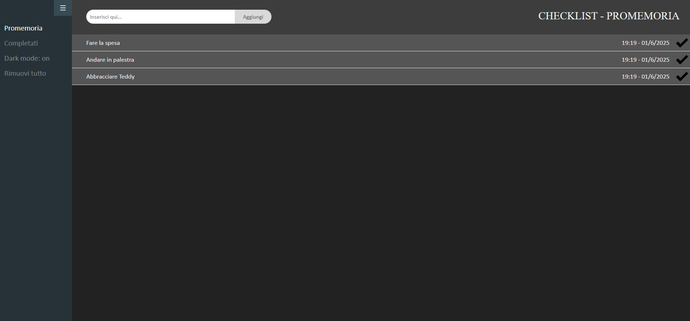
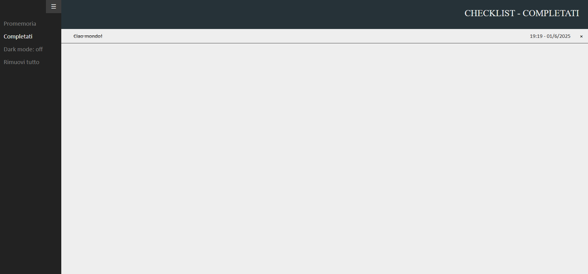

# CSS Checklist

**Live Site:** [tomasoni-checklist.infinityfreeapp.com](https://tomasoni-checklist.infinityfreeapp.com)

## Table of Contents
- [Overview](#overview)
- [Reminders](#reminders)
- [Adding a Reminder](#adding-a-reminder)
- [Completed Page](#completed-page)
- [Dark Mode](#dark-mode)
- [Remove All](#remove-all)
- [Sidebar Menu](#sidebar-menu)
- [Screenshot](#screenshot)

## Overview
A simple checklist web app built with HTML, CSS, and JavaScript.  
Data is saved in `localStorage`, allowing the list to persist between sessions.  
It supports dark mode, a sidebar menu, and a page for completed items.

## Reminders
- Reminders are saved in `localStorage`, so they persist after closing the browser or refreshing the page.
- On page load, the app reads and recreates all saved notes.
- Checked notes are automatically moved to the **Completed** page.

## Adding a Reminder
- Write your reminder and either click the **Add** button or press **Enter**.
- The note is saved to `localStorage` along with the current date and time.

## Completed Page
- Completed notes are displayed on a separate page.
- You can delete them from there.
- The initialization function loads the correct type of reminders (active or completed) based on the page name.

## Dark Mode
- Switches the site color scheme by updating the styles of all visible elements.
- The setting and its on/off label are saved in `localStorage` and persist across sessions.

## Remove All
- Clears all saved reminders and user settings from `localStorage`.
- Reloads the page to apply changes.

## Sidebar Menu
- Controlled by three methods:
  - `openMenu()` – called on mouseover
  - `closeMenu()` – called on mouseleave
  - `toggleMenu()` – called by clicking the ☰ icon
- The ☰ button allows users to **pin** the menu open.
- This preference is saved in `localStorage` and maintained between pages.

## Screenshot

